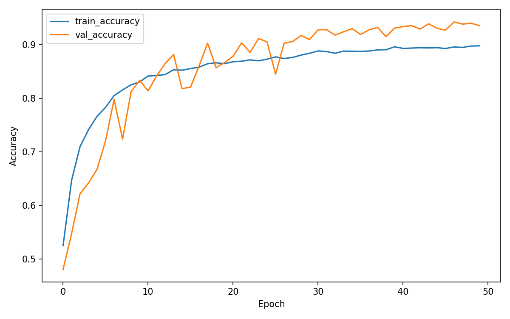
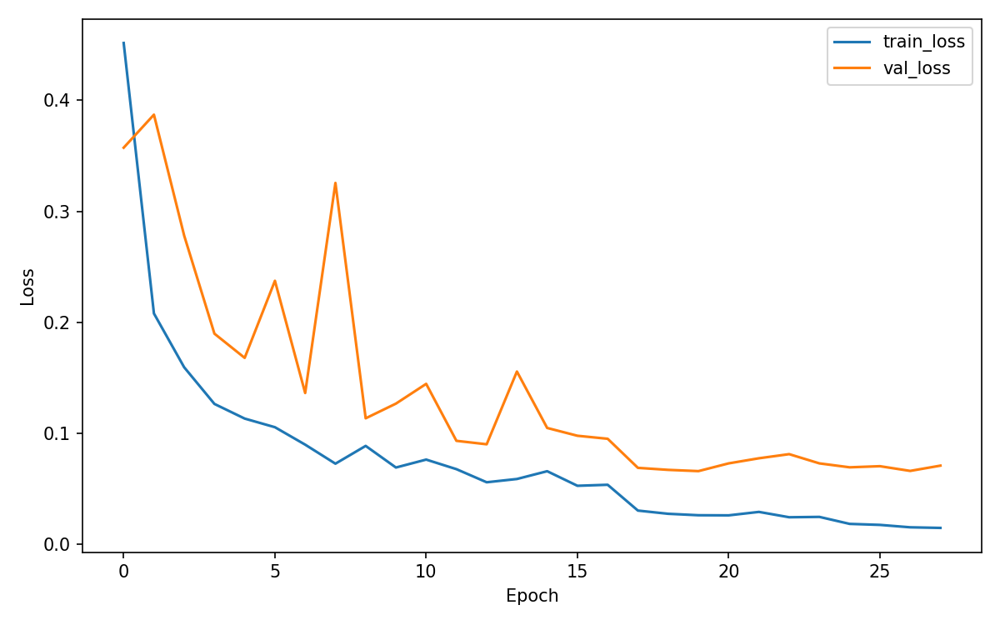
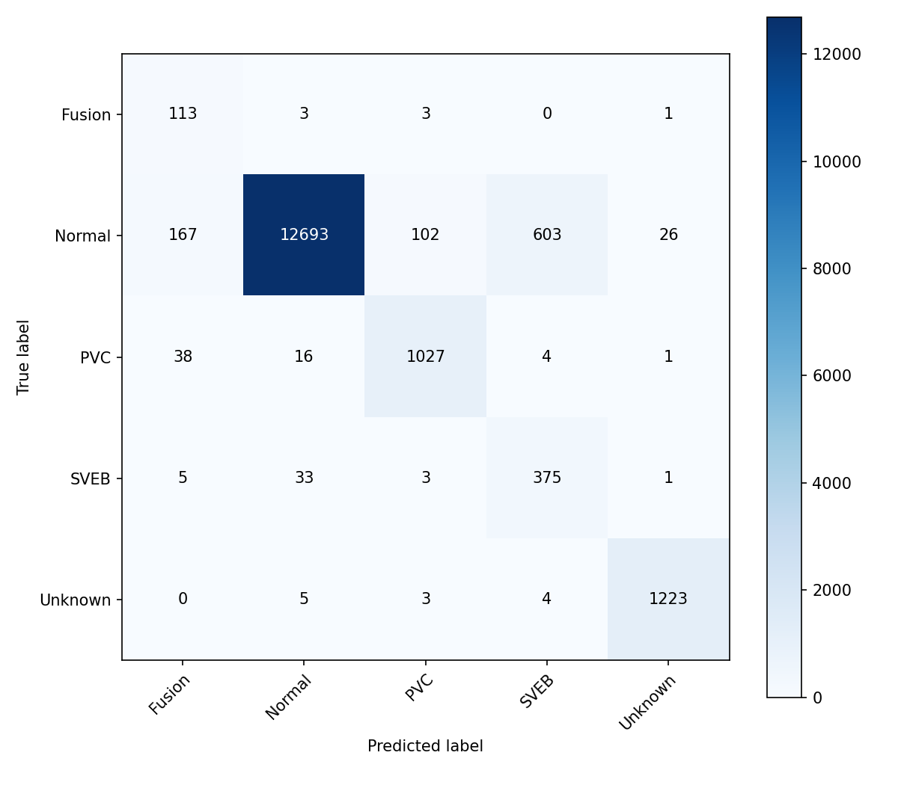

# Explainable ECG Arrhythmia Detection using Deep Learning

## Overview

This repository contains the Machine Learning pipeline for ECG heartbeat classification using the original PhysioNet MIT-BIH Arrhythmia Database.

The project is part of a larger Explainable AI Dashboard for ECG Arrhythmia Detection, where the trained model will later be integrated with SHAP, Grad-CAM, and an interactive Streamlit dashboard.

This repository specifically covers:

* ECG data loading
* Heartbeat extraction
* Signal preprocessing
* Label encoding
* CNN model development
* Model training
* Model evaluation
* Model persistence
* Prediction APIs

Explainability modules and dashboard components are intentionally excluded from this repository and are handled by other team members.

---

# Problem Statement

Cardiac arrhythmias are abnormalities in heart rhythm that can be difficult to identify manually from long ECG recordings.

The objective of this project is to:

* Process raw ECG recordings
* Extract heartbeat-centered ECG segments
* Classify heartbeat types using Deep Learning
* Provide reliable predictions for downstream Explainable AI modules

---

# Environment Setup

For macOS, XGBoost may require the OpenMP runtime:

```bash
brew install libomp
```

Then install Python dependencies in the project environment:

```bash
pip install -r requirements.txt
```

# Dataset

Dataset: MIT-BIH Arrhythmia Database (PhysioNet)

Characteristics:

* 48 ECG recordings
* 47 patients
* Two-channel ambulatory ECG recordings
* Sampling Frequency: 360 Hz
* Approximately 110,000 annotated heartbeats
* Expert cardiologist annotations

Files used:

* .dat → ECG signal files
* .hea → Header files
* .atr → Annotation files

Data is loaded directly using the WFDB library.

Expected dataset layout:

```text
data/
├── 100.dat
├── 100.hea
├── 100.atr
├── 101.dat
├── 101.hea
├── 101.atr
...
├── 234.dat
├── 234.hea
└── 234.atr
```

---

# Heartbeat Classes

AAMI-style heartbeat grouping is used.

| Class   | Symbols       |
| ------- | ------------- |
| Normal  | N, L, R, e, j |
| SVEB    | A, a, J, S    |
| PVC     | V, E          |
| Fusion  | F             |
| Unknown | /, f, Q       |

For symbol-level experiments:

```bash
python -m src.train --label-scheme symbol
```

---

# Data Processing Pipeline

Pipeline:

Raw ECG Record

↓

WFDB Loading

↓

Annotation Extraction

↓

Beat Extraction

↓

Normalization

↓

Label Encoding

↓

Train / Validation / Test Split

↓

CNN Training

Heartbeat window:

* 100 samples before R-peak
* 100 samples after R-peak

Final heartbeat length:

200 samples

---

# Model Architecture

A 1D Convolutional Neural Network (CNN) is used for heartbeat classification.

Architecture:

```text
Input (200 × 1)

↓

Conv1D

↓

Batch Normalization

↓

MaxPooling1D

↓

Conv1D

↓

Batch Normalization

↓

MaxPooling1D

↓

Dropout

↓

Dense Layer

↓

Softmax Output
```

Framework:

* TensorFlow 2.21
* Keras

Training Features:

* EarlyStopping
* ReduceLROnPlateau
* ModelCheckpoint

Optimizer:

* Adam

Loss Function:

* Categorical Crossentropy

---

# Project Structure

```text
data/       MIT-BIH ECG files
docs/       Project reports and documentation
models/     Saved model artifacts
notebooks/  Exploratory notebooks
results/    Metrics, reports and plots
src/        Source code
tests/      Unit tests
```

---

# Training

Train the model:

```bash
python -m src.train --data-dir data --epochs 50 --batch-size 128
```

Training generates:

```text
models/ecg_cnn.keras
models/label_encoder.joblib

results/dataset_summary.json
results/training_metadata.json
results/training_history.json
results/training_history.csv
results/loss_curve.png
results/accuracy_curve.png
```

Quick smoke test:

```bash
python -m src.train --data-dir data --max-records 3 --epochs 2
```

---

# Evaluation

Run evaluation:

```bash
python -m src.evaluate --data-dir data
```

Generated outputs:

```text
results/evaluation_metrics.json
results/classification_report.txt
results/confusion_matrix.csv
results/confusion_matrix.png
```

---

# Model Performance

## Overall Metrics

| Metric             | Value  |
| ------------------ | ------ |
| Accuracy           | 98.50% |
| Macro Precision    | 88.23% |
| Macro Recall       | 94.42% |
| Macro F1 Score     | 90.67% |
| Weighted Precision | 98.67% |
| Weighted Recall    | 98.50% |
| Weighted F1 Score  | 98.56% |

## Class-wise Results

| Class   | Precision | Recall | F1 Score |
| ------- | --------- | ------ | -------- |
| Fusion  | 0.57      | 0.88   | 0.69     |
| Normal  | 1.00      | 0.99   | 0.99     |
| PVC     | 0.96      | 0.97   | 0.96     |
| SVEB    | 0.90      | 0.89   | 0.90     |
| Unknown | 0.99      | 0.99   | 0.99     |

The lower Fusion-class performance is expected due to class imbalance and morphological similarity with neighboring heartbeat categories.

---

# Training Curves

## Accuracy Curve



## Loss Curve



## Confusion Matrix



---

# Saved Artifacts

Model:

```text
models/ecg_cnn.keras
```

Label Encoder:

```text
models/label_encoder.joblib
```

These artifacts are used by the Explainable AI and Dashboard modules.

---

# Prediction API

Example usage:

```python
import numpy as np
from src.predict import predict_ecg

heartbeat = np.load("example_heartbeat.npy")

result = predict_ecg(heartbeat)

print(result)
```

Returned format:

```python
{
    "predicted_class": "PVC",
    "confidence": 0.96,
    "class_probabilities": {
        "Fusion": 0.01,
        "Normal": 0.02,
        "PVC": 0.96,
        "SVEB": 0.01,
        "Unknown": 0.00
    }
}
```

Reusable predictor:

```python
from src.predict import ECGPredictor

predictor = ECGPredictor()
result = predictor.predict(heartbeat)
```

---

# Testing

Run all unit tests:

```bash
python -m pytest -v
```

Current status:

* 10/10 tests passing

---

# Future Work

The trained model will be integrated with:

* SHAP Explanations
* Grad-CAM Visualizations
* Streamlit Dashboard
* Interactive ECG Analysis
* Explainable AI Components

---

# Team Contributions

## Person 1 – Machine Learning Engineer

* MIT-BIH Data Loading
* ECG Beat Extraction
* Signal Preprocessing
* Label Encoding
* CNN Model Development
* Training Pipeline
* Evaluation Pipeline
* Prediction API

## Person 2 – Explainable AI Engineer

* SHAP Integration
* Grad-CAM Integration
* Explanation Generation

## Person 3 – Dashboard & Visualization Engineer

* Streamlit Dashboard
* Visual Analytics
* UI/UX Design
* Presentation and Deployment
